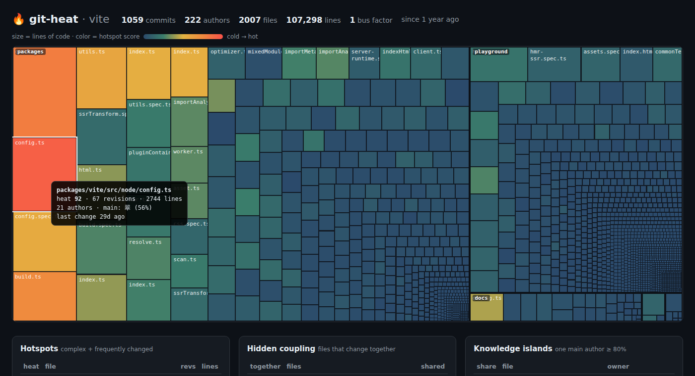

# 🔥 git-heat

**Find the code that will hurt you next.**

`git-heat` reads your git history and tells you where your technical debt actually lives: the complex files everyone keeps touching, the files that secretly change together, the code only one person understands, and how many people can leave before half the codebase is orphaned.

Zero dependencies. One file. Read-only. Runs in seconds on repos with thousands of commits.



## Quick start

```bash
git clone https://github.com/CedricPoint/git-heat.git
node git-heat/git-heat.js /path/to/your/repo
```

Or put it on your `PATH`:

```bash
cd git-heat && npm link
git-heat              # in any repository
```

Requires Node.js 18+ and git.

## What you get

Real output on [vitejs/vite](https://github.com/vitejs/vite) (last 12 months, 2.6 s):

```text
  🔥 git-heat · vite · since 1 year ago · 1059 commits · 222 authors · 2007 files · 107,298 lines

  HOTSPOTS — complex files that keep changing. Refactor these first.
     heat              file                                              revs  lines  authors
   1 ███████████░  92  packages/vite/src/node/config.ts                    67   2744       21
   2 █████████░░░  76  packages/vite/src/node/plugins/css.ts               51   3383       26
   3 ████████░░░░  68  packages/vite/src/node/build.ts                     52   1851       16
   4 ██████░░░░░░  53  packages/vite/src/node/utils.ts                     42   1817       22

  HIDDEN COUPLING — files that always change together. Missing abstraction?
    77%  …yground/hmr-full-bundle-mode/index.html ⟷ playground/hmr-full-bundle-mode/main.js (5×)
   100%  …ze-deps/__tests__/optimize-deps.spec.ts ⟷ playground/optimize-deps/index.html (10×) test pair

  KNOWLEDGE ISLANDS — code that lives in one head.
    98%  …reate-vite/template-lit/src/my-element.js   Alexander Lichter (gone 3mo ago)
    92%  packages/vite/types/importGlob.d.ts          Nathan H. Leung (gone 4mo ago)

  HEATING UP — much more activity in the last 30 days than usual.
    ×3.2  …es/vite/src/node/plugins/importAnalysisBuild.ts 5 commits this month

  BUS FACTOR  1 — if 翠 leaves, more than half of the code loses its main author.
```

### 🔥 Hotspots

A file that is complex but never changes is fine. A file that changes all the time but is trivial is fine. A file that is **both** is where bugs, slow reviews and merge conflicts come from. That's a hotspot.

`heat = change frequency × complexity`, scaled 0–100. Complexity is measured with **indentation depth**, a language-agnostic proxy for nesting that correlates well with cyclomatic complexity and works on any language without a parser.

### 🔗 Hidden coupling

Pairs of files that change in the same commits most of the time (≥ 50%, at least 5 times). When they live in different modules, that's a dependency your architecture doesn't show. Expected pairs (a file and its test) are labelled and ranked last.

Huge commits (more than 25 files: formatting, mass renames) are ignored, because they say nothing about real coupling.

### 🏝️ Knowledge islands

Files where one person wrote 80%+ of the recent lines. When that person hasn't committed in 90 days, they're flagged as **gone**. That's the code nobody will dare to touch.

### 🚌 Bus factor

How many top owners have to leave before more than half of the code (by lines) loses its main author.

### 📈 Heating up

Files with far more activity in the last 30 days than their usual monthly rate. Something is going on there.

## Options

```text
git-heat [repo] [options]

  --since <when>     History window, anything git understands (default: "1 year ago")
  --top <n>          Rows per section (default: 10)
  --exclude <glob>   Ignore paths (repeatable), e.g. --exclude "docs/**"
  --include <glob>   Only analyse matching paths (repeatable)
  --min-shared <n>   Min. shared commits for a coupling pair (default: 5)
  --all-files        Also rank docs, config and data files (default: source code only)
  --include-bots     Count commits from bots (dependabot, renovate, …)
  --json             Print the full analysis as JSON
  --md               Print a Markdown report (great for PR comments / CI summaries)
  --html [file]      Write an interactive HTML report (default: git-heat.html)
  --no-color         Disable colors (also respects NO_COLOR)
```

Sensible defaults: renames are followed (a file keeps its history after `git mv`), `.mailmap` is respected, bots are ignored, and lock files, build output, vendored code, minified files and assets are skipped.

## In CI

Add a hotspot report to every run's summary:

```yaml
- uses: actions/checkout@v4
  with:
    fetch-depth: 0          # git-heat needs history
- run: |
    curl -sSLo git-heat.js https://raw.githubusercontent.com/CedricPoint/git-heat/main/git-heat.js
    node git-heat.js --md --top 10 >> "$GITHUB_STEP_SUMMARY"
```

## How it works

1. `git log --numstat -M` over the window, parsed in one pass. Renames (`src/{a => b}/x.js`) are resolved so history follows the file.
2. Every tracked source file is read once to measure lines and indentation complexity.
3. Co-change pairs are counted per commit to compute coupling degree.
4. Authorship is weighted by lines added, per file, to find owners and islands.

Nothing is written to your repository and nothing leaves your machine.

> Tip: on a partial clone (`--filter=blob:none`), git has to download file contents on the fly for `--numstat`, which is slow the first time. Use a regular clone for big repos.

## Credits

The ideas behind hotspots, temporal coupling and knowledge maps come from Adam Tornhill's *Your Code as a Crime Scene*. `git-heat` is an independent, dependency-free take on them.

## License

MIT
